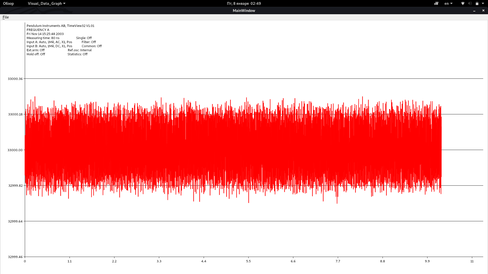

********************************************************************************
Visual Data Graph 

Created by E-Protocol
https://github.com/e-protocol

Author: E-Protocol

Specs: Linux Debian x64, Qt 5.15.1

Description:
This Application draw graph from data file. Read formats: .ssd, .txt

How to use:
1) run application in build folder ./Visual_Data_Graph
2) to change precision point go to menu File->Settings
3) load data from folder /SamplesFiles. File->Load Data->(choose path to data file)
